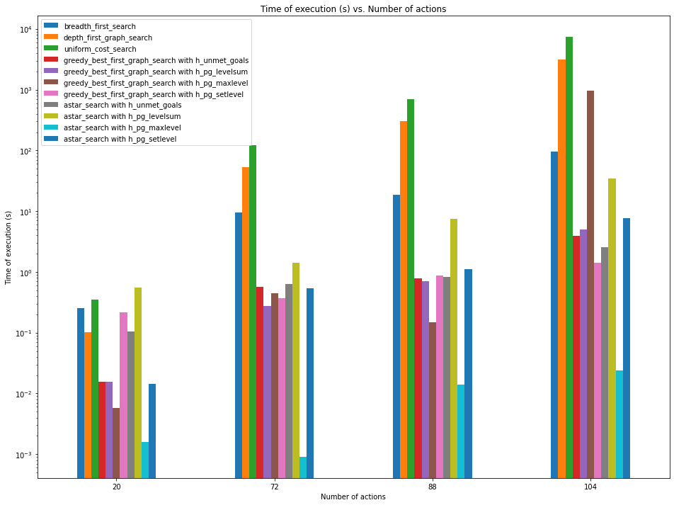

# Building a Forward Planning Agent

**Author**: Ray Phan

**Date**: June 18, 2021

## Section 1 - Analyze the search complexity as a function of domain size, search algorithm, and heuristic.

### Table 1: Number of nodes expanded against number of actions the domain

#### Notation:
* ACP #x: Air Cargo Problem #x, where `x = {1, 2, 3, 4}`
* NoE: Number of Expansions

#### Number of actions for each ACP
* ACP #1: 20
* ACP #2: 72
* ACP #3: 88
* ACP #4: 104

| Algorithm | NoE ACP #1 | NoE ACP #2 | NoE ACP #3 | NoE ACP #4 |
| :-: | :-: | :-: | :-: | :-: |
| `breadth_first_search` | 43 | 3343 | 14663 | 99736 |
| `depth_first_graph_search` | 21 | 624 | 408 | 25174 |
| `uniform_cost_search` | 60 | 5154 | 18510 | 113339 |
| `greedy_best_first_graph_search with h_unmet_goals` | 7 | 17 | 25 | 29 |
| `greedy_best_first_graph_search with h_pg_levelsum` | 6 | 9 | 14 | 17 |
| `greedy_best_first_graph_search with h_pg_maxlevel` | 6 | 27 | 21 | 56 |
| `greedy_best_first_graph_search with h_pg_setlevel` | 6 | 9 | 35 | 107 |
| `astar_search with h_unmet_goals` | 50 | 2467 | 7388 | 34330 |
| `astar_search with h_pg_levelsum` | 28 | 357 | 369 | 1208 |
| `astar_search with h_pg_maxlevel` | 43 | 2887 | 9580 | 62077 |
| `astar_search with h_pg_setlevel` | 33 | 1037 | 3423 | 22606 |

#### Bar Chart #1: Number of nodes expanded against number of actions the domain

*NOTE:* The source used to create the bar chart can be found in the Jupyter
notebook found in this assignment directory.

*NOTE #2*: The `y`-axis is logarithmically scaled to account for the large difference
in counts between Air Cargo Problem #1 and Air Cargo Problem #4.

#### Analysis
We can see from the above table and bar chart that the number of expanded nodes
increases with the number of available actions increases.  Uniform cost search
overall had the most number of expansions over all Air Cargo Problems.  Greedy
Best First Search regardless of the heuristic used had the minimum number of
expanded nodes - most notably the level sum heuristic.

## Section 2 - Analyze search time as a function of domain size, search algorithm, and heuristic.

### Table 2: Search time against number of actions in the domain

#### Notation:
* ACP #x: Air Cargo Problem #x, where `x = {1, 2, 3, 4}`
* Time is in seconds - Reported up to 4 significant digits

#### Number of actions for each ACP
* ACP #1: 20
* ACP #2: 72
* ACP #3: 88
* ACP #4: 104

*NOTE:* The timings reported were done using the vanilla Python interpreter instead
of the one advocated in the course, which is known as [PyPy](https://www.pypy.org/). 
The main differences are that the interpreter is memory efficient and has a
Just-In-Time (JIT) compiler to promote faster execution times.  You should be
able to get faster times than what was reported here.  Please be warned that
by running all algorithms and all Air Cargo Problems, this took almost 20 hours
from start to finish.

| Algorithm | ACP #1 Time | ACP #2 Time | ACP #3 Time | ACP #4 Time |
| :-: | :-: | :-: | :-: | :-: |
`breadth_first_search` | 0.002741 | 0.750691 | 4.033733 | 34.138896 |
`depth_first_graph_search`| 0.001285 | 1.046726 | 0.412032 | 1662.581463 |
`uniform_cost_search`| 0.003717| 1.254512| 5.413008| 43.969574 |
`greedy_best_first_graph_search with h_unmet_goals`| 0.000680| 0.007083 | 0.013501 | 0.027991 |
`greedy_best_first_graph_search with h_pg_levelsum`| 0.130337 | 3.147468 | 6.784207 | 12.770362 |
`greedy_best_first_graph_search with h_pg_maxlevel`| 0.098532 | 6.778790 | 8.274974 | 30.629671 |
`greedy_best_first_graph_search with h_pg_setlevel`| 0.384688 | 12.498412 | 41.165263| 189.622256 |
`astar_search with h_unmet_goals`| 0.003708 | 0.951237 | 3.038839 | 19.462309 |
`astar_search with h_pg_levelsum`| 0.343998 | 86.461936 | 127.184878 | 701.509870 |
`astar_search with h_pg_maxlevel`| 0.363049 | 515.123884 | 2206.690555 | 25341.034564 |
`astar_search with h_pg_setlevel`| 0.968349 | 681.692551 | 2814.682069 | 32038.440665 |

#### Bar Chart #2: Number of nodes expanded against number of actions in the domain

*NOTE:* The source used to create the bar chart can be found in the Jupyter
notebook found in this assignment directory.

*NOTE #2*: The `y`-axis is logarithmically scaled to account for the large difference
in counts between Air Cargo Problem #1 and Air Cargo Problem #4.

#### Analysis
As seen from the above table and bar chart, we can also verify that the search time increases when
the number of available actions increases.  Specifically, for Air Cargo Problem #1, we can see that
the times were amongst the shortest across all algorithms.  For Air Cargo Problem #4, this created
the longest times across all algorithms.  For each Air Cargo Problem, A* search with the max level
heuristic generally had the shortest search times, whereas A* search with the level sum heuristic
took the most time for Air Cargo Problem #1, and Uniform Cost Search took the most time for Air
Cargo Problems #2, #3 and #4.  In general, the uninformed search algorithms (Breadth-First Search,
Depth-First Search and Uniform Cost Search) took more time to execute than the informed search
algorithms (Greedy Best First Search and A*).  The heuristics definitely have an effect on the
search time for the informed search algorithms when it comes to the available action space.  We
notice that the search time grows as the available action space grows.

## Section 3 - Analyze the optimality of solution as a function of domain size, search algorithm and heuristic

### Table 3: Plan length against the number of actions in the domain

#### Notation:
* ACP #x: Air Cargo Problem #x, where `x = {1, 2, 3, 4}`
* PL: Plan Length

#### Number of actions for each ACP
* ACP #1: 20
* ACP #2: 72
* ACP #3: 88
* ACP #4: 104

| Algorithm | PL ACP #1 | PL ACP #2 | PL ACP #3 | PL ACP #4  |
| :-: | :-: | :-: | :-: | :-: |
| `breadth_first_search` | 6 | 9 | 12 | 14 |
| `depth_first_graph_search` | 20 | 619 | 392 | 24132 |
| `uniform_cost_search` | 6 | 9 | 12 | 14 |
| `greedy_best_first_graph_search with h_unmet_goals` | 6 | 9 | 15 | 18 |
| `greedy_best_first_graph_search with h_pg_levelsum` | 6 | 9 | 14 | 17 |
| `greedy_best_first_graph_search with h_pg_maxlevel` | 6 | 9 | 13 | 17 |
| `greedy_best_first_graph_search with h_pg_setlevel` | 6 | 9 | 17 | 23 |
| `astar_search with h_unmet_goals` | 6 | 9 | 12 | 14 |
| `astar_search with h_pg_levelsum` | 6 | 9 | 12 | 15 |
| `astar_search with h_pg_maxlevel` | 6 | 9 | 12 | 14 |
| `astar_search with h_pg_setlevel` | 6 | 9 | 12 | 14 |

#### Bar Chart #3: Number of nodes expanded against number of actions the domain

*NOTE:* The source used to create the bar chart can be found in the Jupyter
notebook found in this assignment directory.

*NOTE #2*: The `y`-axis is logarithmically scaled to account for the large difference
in counts between Air Cargo Problem #1 and Air Cargo Problem #4.

#### Analysis
We can see from the above table and bar chart that the plan length increases with the number
of available actions increasing.  Depth-first search is the most problematic and produced the
longest plan across all Air Cargo Problems.  All of the other algorithms showed comparable plan
lengths for Air Cargo Problems #1 and #2.  For Air Cargo Problems #3 and #4, the increasing available
action size demonstrates that Breadth-First Search, Uniform-Cost Search and A* produced the shortest
plans.